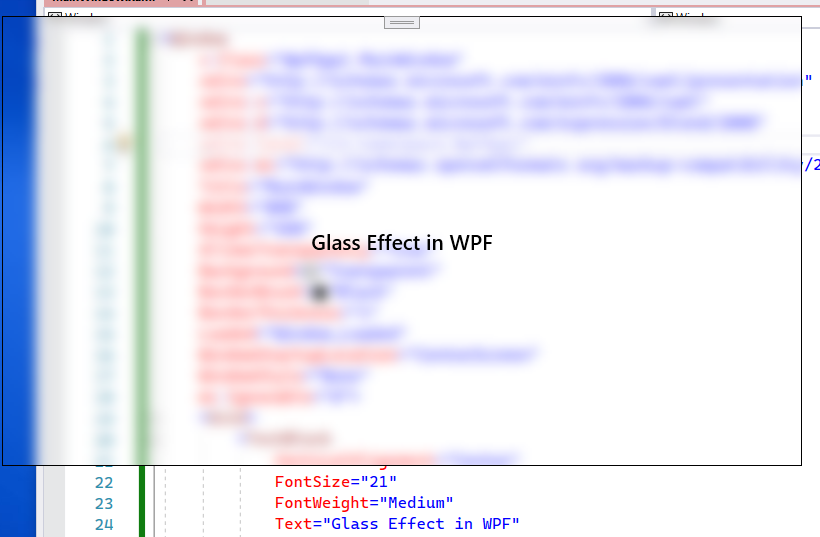

# Glass Effect

  [You can download the project](GlassEffectWPF.zip) <br> <br>



import after constructor
```  c#
        #region Glass effect

        [DllImport("user32.dll")]
        internal static extern int SetWindowCompositionAttribute(IntPtr handle, ref WindowCompositionAttributeData compositionAttributeData);

        internal enum AccentState { AccentEnableBlurbehind = 3 }

        [StructLayout(LayoutKind.Sequential)]
        internal struct AccentPolicy
        {
            public AccentState AccentState;
            public int AccentFlags;
            public int GradientColor;
            public int AnimationId;
        }

        [StructLayout(LayoutKind.Sequential)]
        internal struct WindowCompositionAttributeData
        {
            public WindowCompositionAttribute Attribute;
            public IntPtr Data;
            public int SizeOfData;
        }

        internal enum WindowCompositionAttribute { WcaAccentPolicy = 19 }

        internal void EnableBlur()
        {
            IntPtr windowHelper = new WindowInteropHelper(this).Handle;
            AccentPolicy accentPolicy = new AccentPolicy { AccentState = AccentState.AccentEnableBlurbehind };
            int accentStructSize = Marshal.SizeOf(accentPolicy);
            IntPtr accentPtr = Marshal.AllocHGlobal(accentStructSize);
            Marshal.StructureToPtr(accentPolicy, accentPtr, false);
            WindowCompositionAttributeData windowCompositionAttributeData = new WindowCompositionAttributeData
            {
                Attribute = WindowCompositionAttribute.WcaAccentPolicy,
                SizeOfData = accentStructSize,
                Data = accentPtr
            };
            SetWindowCompositionAttribute(windowHelper, ref windowCompositionAttributeData);
            Marshal.FreeHGlobal(accentPtr);
        }
        private void Window_Loaded(object sender, RoutedEventArgs e) => EnableBlur();
        #endregion Glass Effect 

```


Don't forget imports

> ```  c#
> 
> using  System.Runtime.InteropServices;
> using  System.Windows.Interop;
> 
> ```

  

Go to .xaml file and add the properties to Window 

```  xaml

<Window AllowsTransparency="True" Background="Transparent" Loaded="Window_Loaded" WindowStyle="None" />

```

## You can [create issue](https://github.com/kadir-ince/WPF-Gists/issues) if you get error(s)